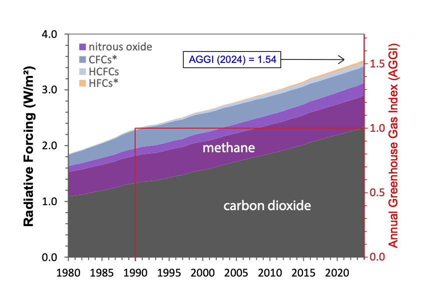

| [home page](https://passiripie.github.io/pbodhida-dataviz-portfolio/) | [data viz examples](dataviz-examples) | [critique by design](critique-by-design) | [final project I](final-project-part-one) | [final project II](final-project-part-two) | [final project III](final-project-part-three) |

# Critique and redesign - The NOAA Annual Greenhouse Gas Index (AGGI)

## Step one: the visualization

The original visualization is from this academic article about the NOAA Annual Greenhouse Gas Index (AGGI): https://gml.noaa.gov/aggi/aggi.html

I chose this visualization because it contains multiple elements, such as 2 vertical axes, reference lines, legend, and annotation. I admired how the creator tried to communicate every aspects of information from the given data and added all elements mentioned, but this makes the chart very confusing. So, I find it challenging and exciting to redesign this chart. Moreover, I have never created a stacked area chart before, so I think this is a good opportunity for me to try working on that, and probably do something creative.

## Step two: the critique

The visualization attempts to show the growth in radiative forcing compositions over time with a reference period, which is an interesting idea, and the area chart helps represent overall growth. However, the way AGGI and the reference line are presented makes it hard to understand the comparison between the reference period and other years. Some elements also reduce clarity, such as the lack of a title, unclear x-axis tick marks, inconsistent gas labels, and arbitrary color choices. Although the chart may still be readable for researchers or technically familiar audiences, it does not communicate the key insight clearly and does not reach its full potential.

In my redesign, I want to focus on highlighting the changes in radiative forcing compared to the reference period. I am considering using a surplus/deficit style chart to show increases and decreases more clearly. I may still use an area chart but only for major gases like CO₂ and methane, grouping the rest as “others.” I also plan to remove the AGGI right axis and instead show AGGI as annotations for key years. Additionally, I want to improve the overall design by adding a clear title and subtitle, using more consistent labeling, and experimenting with lighter colors and outlines to make the visualization more visually pleasing and easier to read.

## Step three: Sketch a solution

## Step four: Test the solution

_Before you conduct your interviews, prepare a simple script.  Use this as a guide and as a way to take notes as you go forward. Come up with your own list of questions you want to ask for the selected visualization. Keep the questions broad so you can get the most value out of your feedback. Then, document answers to your questions here._

Questions to ask (modify these for your own interviews): 

- Can you tell me what you think this is?

- Can you describe to me what this is telling you?

- Is there anything you find surprising or confusing?

- Who do you think is the intended audience for this?

- Is there anything you would change or do differently?

Results: 

_Don't identify or share personally identifiable information (PII) about the people you spoke to._

| Question | Interview 1 | Interview 2 |
|----------|-------------|-------------|
|          |             |             |
|          |             |             |
|          |             |             |

Synthesis: 

_What patterns in the feedback emerge?  What did you learn from the feedback?  Based on this feedback, come up with what design changes you think might make the most sense in your final redesign._

## Step five: build the solution

_Include and describe your final solution here. It's also a good idea to summarize your thoughts on the process overall. When you're done with the assignment, this page should all the items mentioned in the assignment page on Canvas(a link or screenshot of the original data visualization, documentation explaining your process, a summary of your wireframes and user feedback, your final, redesigned data visualization, etc.)._

## References
_List any references you used here._

## AI acknowledgements
_If you used AI to help you complete this assignment (within the parameters of the instruction and course guidelines), detail your use of AI for this assignment here._

